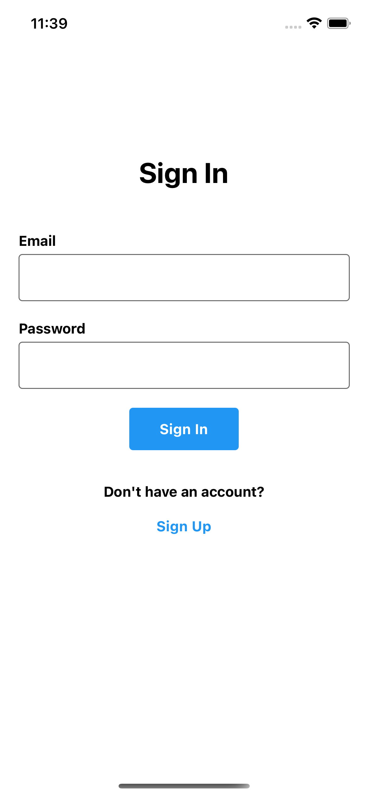
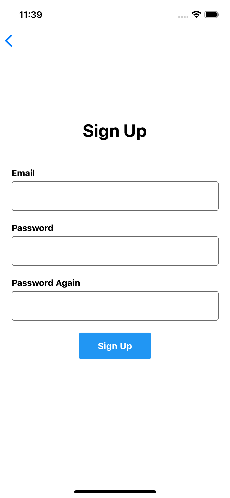

# React Native Music App

EN - This project is the fiveth assignment within the scope of "Akbank React Native Bootcamp" organized by Patika.dev. It includes the sign in and sign up screen, home screen, search screen and settings screens.

TR - Bu proje Patika.dev 'in düzenlediği "Akbank React Native Bootcamp" kapsamında yapılan beşinci ödevdir. Music App uygulamasında giriş ve kayıt ekranı, müzik ve playlistlerin listelendiği ana ekran, müzik arama ekranı ve ayarlar ekranı bulunmaktadır.
<br/><br/>

## Screens

### Gif


### ScreenShot

<table>
    <tbody>
        <tr>
            <td></td>
            <td></td>
        </tr>
    </tbody>
</table>
<br/>
<br/>

## Technologies


<br/>

## Packages

- Expo
- Firebase
- Axios
- React Navigation
- Async Storage
- ReduxJS Toolkit

<br/>

### Features

- "Napster API Version 2.2 is used in this project. <a href="https://developer.prod.napster.com/developer">Napster API</a>
- Sign in Screen
- Sign up Screen
- Home Screen
- Search Screen
- Setting Screen
- Supports dark/light mode 🌗

### Todo

- Music details page
- Music rates
- New additional features to the settings page

## Installation

```
yarn install
yarn start
```
